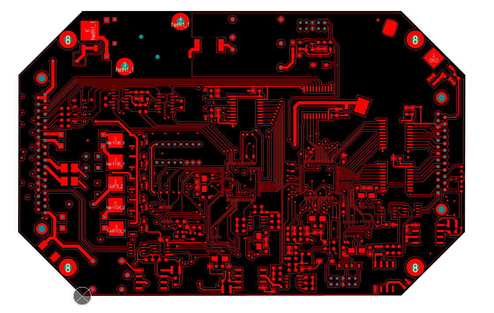
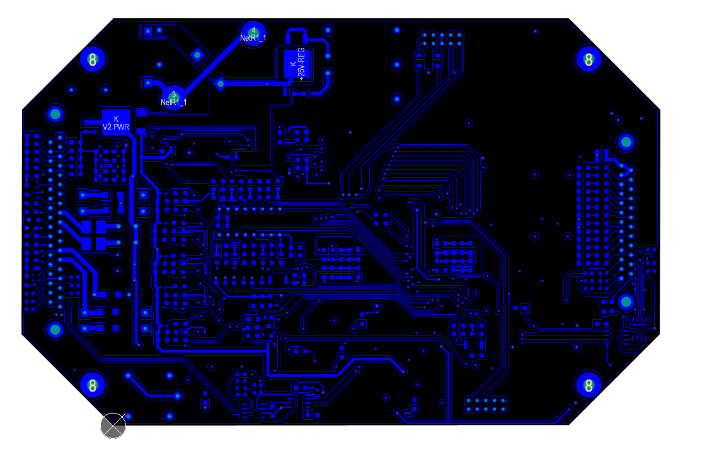
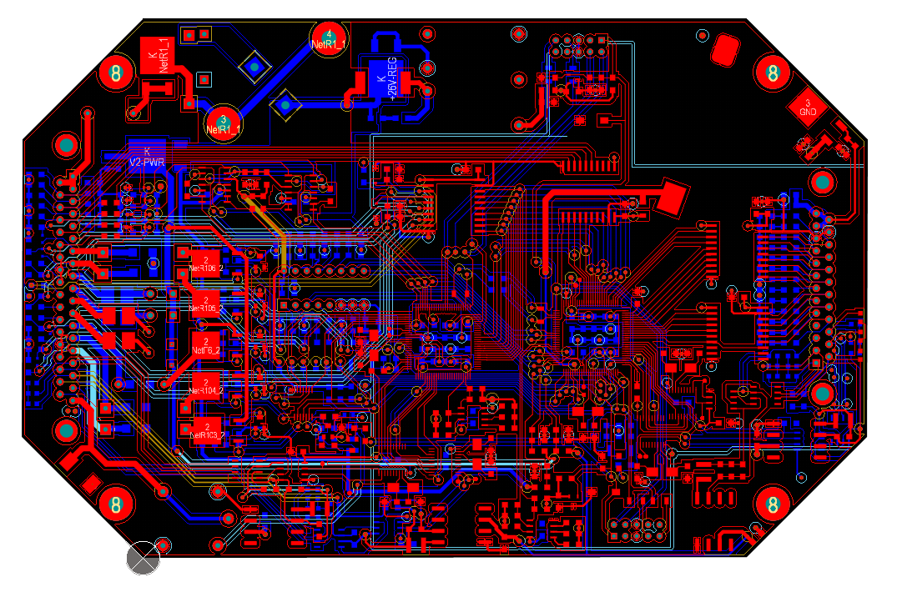

# Vehicle Fire Suppression Box (FSB) PCB

A four-layer PCB I designed for an embedded fire detection and suppression system used in a vehicle's engine compartment. The board monitors multiple sensors in real time and runs the decision logic that triggers the suppression system when a fire condition is actually confirmed.

> Note: this repo is meant as a technical case study. Design files, schematics files, and firmware are not included, this project falls under a confidentiality agreement.

## What it does

The FSB reads input from several sensors placed around the engine compartment, continuously checks that data against the system's fire-detection logic, and if a real fire condition is confirmed, triggers the suppression mechanism connected to the board. It's built to run reliably in a rough operating environment (heat, vibration, electrical noise), where the system absolutely needs to behave predictably and can't afford false negatives or unnecessary false triggers either.

## My part in it

- Four-layer PCB design and component placement
- Hardware architecture and peripheral integration
- Interfacing multiple sensors to the board
- Embedded firmware for the detection and suppression logic
- Hardware bring-up and functional testing
- System-level testing and debugging

## Design considerations

- Real-time sensor monitoring, since detection speed matters here
- Solid power distribution and protection, given the harsh operating environment
- Layout done with noise in mind, since the board mixes analog sensor signals with digital logic
- Reliable communication between the onboard peripherals
- Built for reliability and easy maintenance over the vehicle's service life

## Tools and technologies

STM32 microcontroller, embedded C, Altium Designer for the four-layer PCB, and general analog/digital signal conditioning for the sensor interfaces.

## What's in this repo

Just PCB photos and this overview. Design files, schematics, firmware source, manufacturing files, and detailed hardware documentation are intentionally left out due to confidentiality.

## Images

**Top layer**

**Bottom layer**

**2D View**

<!--
*(A photo of the assembled hardware will be added here later.)*
-->
## Disclaimer

This repo is a high-level overview of engineering work I did as part of a professional project. All proprietary implementation details stay confidential and aren't included here.
